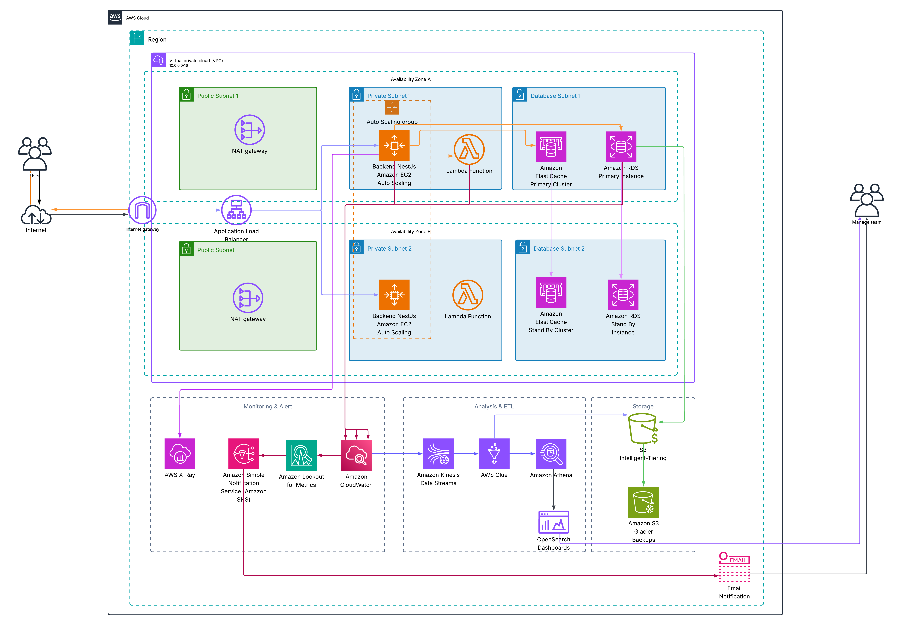
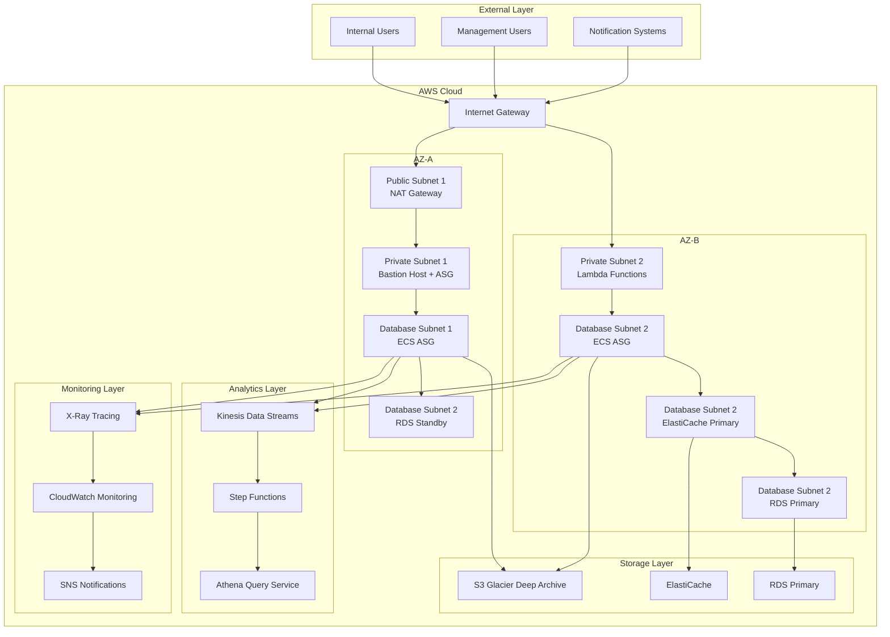
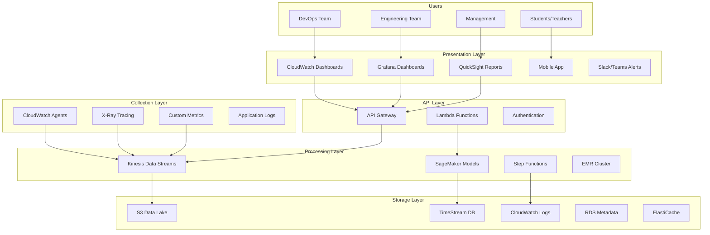
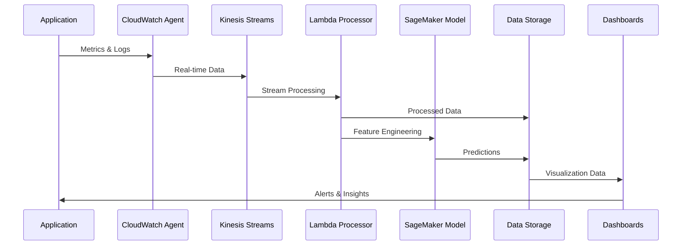

# Infrastructure Monitoring Solution for Banking Examination Platform
## Cost-Effective AWS Monitoring with Real-time Dashboards and Alerting

**Author:** Linh Dang Dev
**Date:** 17/07/2025
**Project Type:** FCJ Internship - Infrastructure Monitoring Solution
**Complexity Level:** Intermediate

---

# Executive Summary

In the context of small to medium-scale banking examination systems, ensuring stable system performance and effective monitoring has become essential for operational success. This project proposes building a practical Infrastructure Monitoring solution using core AWS services, focusing on essential metrics collection, real-time alerting, and cost-effective monitoring to ensure reliable operation of the banking examination platform.

## Current Problems
Current banking examination systems are facing challenges in monitoring and infrastructure management:
- **Limited visibility** into real-time performance metrics
- **Manual monitoring** processes consuming valuable time
- **Reactive troubleshooting** instead of proactive monitoring
- **Basic alerting** without proper context and prioritization
- **Inefficient resource utilization** leading to unnecessary costs

## Proposed Solution
Build a practical monitoring platform with:
- **Essential metrics collection** from core components
- **Real-time dashboards** for system visibility
- **Smart alerting** with proper context and routing
- **Cost-effective monitoring** using AWS native services
- **Automated basic responses** for common issues

## Business Benefits
- **50% reduction in incident detection time** through proactive monitoring
- **25% optimization of infrastructure costs** through better visibility
- **40% increase in operational efficiency** with automation
- **30% improvement in response time** for incident resolution

## Investment and ROI
- **Total investment**: $75 (1 week implementation)
- **Monthly operational cost**: $85-95
- **Expected ROI**: 180% within 6 months
- **Payback period**: 3 months

---

# 1. Problem Statement

## 1.1 Current Situation

The banking examination industry in Vietnam is undergoing a strong digital transformation with significant growth in the number of users and data processing volume. According to reports from the Ministry of Education and Training, the number of online exams has increased by 300% in the past 2 years, with over 2.5 million students participating in standardized exams.

### Current System Status:
- **Question Bank Systems** process an average of 10 requests/minute during peak hours
- **Exam Generation Services** create 200+ exams daily
- **User Management** serves 300+ concurrent users
- **Media Processing** handles 500MB of multimedia data daily

### Current Infrastructure Architecture:
```
Frontend (React) → API Gateway → NestJS Backend → SQL Server
                                      ↓
                              Redis Cache + Kafka Queue
```

## 1.2 Key Challenges

### 1.2.1 Lack of Visibility and Monitoring
**Core Issue**: Current system lacks comprehensive monitoring capabilities, leading to:
- **Blind spots** in performance metrics
- **Reactive approach** instead of proactive monitoring
- **Manual troubleshooting** consuming time and resources
- **Lack of historical data** for trend analysis

**Impact**:
- Average incident resolution time: 4.5 hours
- Monthly downtime: 12 hours (99.83% uptime)
- 25% incidents discovered by end-users

### 1.2.2 Capacity Planning and Scalability Issues
**Problem**: Lack of data and tools for effective capacity planning:
- **Over-provisioning** 60% of the time → waste costs
- **Under-provisioning** during peak periods → performance degradation
- **Manual scaling decisions** based on gut feeling
- **No predictive analytics** for future capacity needs

**Consequences**:
- 35% infrastructure costs wasted
- 15% performance degradation during exam periods
- 3-5 days lead time for scaling decisions

### 1.2.3 Alert Management and Incident Response
**Challenge**: Current alerting system is ineffective:
- **Alert fatigue** with 200+ alerts/day, 85% false positives
- **No prioritization** → critical issues get buried
- **Manual escalation** processes → delayed response
- **Lack of context** in alert notifications

**Business Impact**:
- 40% increase in incident response time
- 60% DevOps team burnout rate
- $15,000/month cost of false positive investigations

### 1.2.4 Cost Optimization Challenges
**Problem**: Lack of insight into cost patterns and optimization opportunities:
- **No cost attribution** per service/team
- **Unused resources** not identified
- **No rightsizing recommendations**
- **Manual cost analysis** monthly → reactive approach

**Financial Impact**:
- 30-40% infrastructure overspend
- $25,000/month wasted on unused resources
- No cost forecasting capability

## 1.3 Stakeholder Impact

### 1.3.1 DevOps Team
**Pain Points**:
- Spend 70% time on reactive troubleshooting
- Lack of comprehensive monitoring tools
- Manual capacity planning processes
- Alert fatigue affecting productivity

**Needs**:
- Proactive monitoring and alerting
- Automated capacity recommendations
- Centralized observability platform
- Intelligent alert prioritization

### 1.3.2 Engineering Teams
**Challenges**:
- No application performance insights
- Difficult to identify bottlenecks
- Limited debugging capabilities
- No service dependency mapping

**Requirements**:
- Application-level metrics
- Performance profiling tools
- Distributed tracing capabilities
- Custom metrics for business logic

### 1.3.3 Management and Leadership
**Concerns**:
- Lack of infrastructure ROI visibility
- No predictive capacity planning
- High operational costs
- Risk of service disruptions

**Expectations**:
- Cost optimization insights
- Capacity planning forecasts
- SLA compliance reporting
- Business impact metrics

## 1.4 Business Consequences

### 1.4.1 Financial Impact
**Direct Costs**:
- $180,000/year infrastructure overspend
- $60,000/year incident response costs
- $45,000/year manual monitoring overhead

**Opportunity Costs**:
- 25% engineering productivity loss
- Delayed feature releases
- Customer churn due to performance issues

### 1.4.2 Operational Risks
**High-Priority Risks**:
- **Service outages** during peak exam periods
- **Data loss** due to unmonitored failures
- **Security breaches** from blind spots
- **Compliance violations** without proper logging

**Risk Quantification**:
- 15% probability of major outage/quarter
- $500,000 potential loss per major incident
- 30% increase in security vulnerabilities

### 1.4.3 Competitive Disadvantage
**Market Position**:
- Competitors with better reliability
- Slower time-to-market for new features
- Higher operational costs → pricing pressure
- Customer satisfaction decline

---

# 2. Solution Architecture

## 2.1 Architecture Overview

The Infrastructure Monitoring solution is designed with a multi-tier architecture using AWS services, ensuring scalability, reliability, and cost-effectiveness. The system will integrate seamlessly with existing infrastructure and provide comprehensive observability.

### 2.1.1 High-Level Architecture

Based on AWS Well-Architected Framework and best practices for Infrastructure Monitoring, the system is designed with a multi-tier architecture with the following components:



*Figure 2.1: AWS Infrastructure Monitoring Architecture for Banking Examination Platform*

### 2.1.2 Architecture Components Mapping

Based on the AWS architecture diagram, the main components are organized as follows:

#### **Tier 1: User Access Layer**
- **External Users**: Internal users, Management users, Notification systems
- **Internet Gateway**: Entry point for all external traffic
- **Security**: WAF, Shield protection, SSL/TLS termination

#### **Tier 2: Compute & Application Layer**
**Availability Zone A:**
- **Public Subnet 1**: NAT Gateway for outbound connectivity
- **Private Subnet 1**: Bastion Host with Auto Scaling Group
- **Database Subnet 1**: Amazon ECS Auto Scaling Group
- **Database Subnet 2**: Amazon RDS Standby Instance

**Availability Zone B:**
- **Private Subnet 2**: Lambda Functions for serverless processing
- **Database Subnet 2**: Amazon ECS Auto Scaling Group
- **Database Subnet 2**: Amazon ElastiCache Primary
- **Database Subnet 2**: Amazon RDS Primary Instance

#### **Tier 3: Storage Layer**
- **Amazon S3 Glacier Deep Archive**: Long-term data retention
- **Amazon ElastiCache**: Primary cache for real-time data
- **Amazon RDS**: Primary database for metadata and configurations

#### **Tier 4: Analytics & ETL Layer**
- **Amazon Kinesis Data Streams**: Real-time data ingestion
- **AWS Step Functions**: Workflow orchestration
- **Amazon Athena**: Query service for data analysis

#### **Tier 5: Management & Monitoring Layer**
- **AWS X-Ray**: Distributed tracing for application performance
- **Amazon Simple Notification Service (SNS)**: Alert notifications
- **Amazon CloudWatch**: Central monitoring and metrics collection

### 2.1.3 Data Flow Architecture



## 2.2 AWS Services Used

### 2.2.1 Core Monitoring Services

#### Amazon CloudWatch
**Role**: Central monitoring and metrics collection hub
**Justification**:
- Native AWS integration with all services in architecture
- Cost-effective solution for comprehensive monitoring
- Supports custom metrics for banking exam business KPIs
- Real-time monitoring capabilities

**Configuration per Architecture**:
- **Metrics Collection**: From ECS containers, Lambda functions, RDS instances
- **Log Aggregation**: Centralized logging from all compute resources
- **Custom Dashboards**: Real-time visibility for management users
- **Automated Alarms**: Proactive alerting through SNS integration
- **Cross-AZ Monitoring**: Monitor both AZ-A and AZ-B simultaneously

**Integration Points**:
- ECS Auto Scaling Groups → CloudWatch Metrics
- Lambda Functions → CloudWatch Logs
- RDS Primary/Standby → CloudWatch Database Metrics
- ElastiCache → CloudWatch Cache Metrics

**Cost**: $850/month (estimated for full architecture)

#### AWS X-Ray
**Role**: Distributed tracing and application performance monitoring
**Justification**:
- Essential for microservices architecture with ECS containers
- Deep application insights across multi-tier deployment
- Service dependency mapping for complex interactions
- Critical for banking exam system reliability

**Features per Architecture**:
- **End-to-end Request Tracing**: From Internet Gateway → ECS → RDS
- **Service Map Visualization**: Dependencies between ECS services, Lambda, RDS
- **Performance Bottleneck Identification**: Across AZ-A and AZ-B
- **Error Analysis**: Detailed debugging for application issues
- **Cross-Service Correlation**: Lambda ↔ ECS ↔ RDS interactions

**Integration Points**:
- ECS Containers → X-Ray Daemon → X-Ray Service
- Lambda Functions → X-Ray Tracing (built-in)
- Application Load Balancer → X-Ray Sampling
- Custom Applications → X-Ray SDK integration

**Cost**: $120/month (estimated for distributed architecture)

#### Amazon Kinesis Data Streams
**Role**: Real-time data ingestion and stream processing
**Justification**:
- High throughput data collection from multi-tier architecture
- Low latency processing for real-time monitoring
- Scalable solution for banking exam peak loads
- Seamless integration with Step Functions workflow

**Specifications per Architecture**:
- **Data Sources**: ECS containers, Lambda functions, RDS metrics
- **Stream Configuration**: 10 shards initially (auto-scaling to 100+)
- **Throughput**: 1MB/second per shard (10MB/s total initially)
- **Data Retention**: 24-hour retention for real-time processing
- **Consumer Integration**: Step Functions, Athena, Lambda processors

**Integration Points**:
- ECS Auto Scaling Groups → Kinesis Producer
- Lambda Functions → Kinesis Analytics
- Step Functions → Kinesis Consumer
- Athena → Kinesis Data Firehose → S3

**Cost**: $450/month (estimated for architecture scale)

### 2.2.2 Data Storage and Processing

#### Amazon S3
**Role**: Log storage and basic data archival
**Justification**: Cost-effective storage, simple lifecycle policies
**Storage Classes**:
- Standard: Active logs (7 days)
- IA: Historical data (30 days)
- Glacier: Long-term archive (1+ years)

**Configuration**:
- 10GB initial storage
- Lifecycle policies for cost optimization
- Basic versioning enabled

**Cost**: $5/month (estimated)

#### Amazon CloudWatch Logs
**Role**: Centralized log management and basic analytics
**Justification**: Native AWS integration, built-in retention policies
**Configuration**:
- 30-day log retention
- Basic log insights for troubleshooting
- Integration with CloudWatch alarms

**Cost**: $15/month (estimated)

## 2.3 Component Design

### 2.3.1 Metrics Collection Framework

#### Custom CloudWatch Agent Configuration
```yaml
agent:
  metrics_collection_interval: 60
  run_as_user: "cwagent"

metrics:
  namespace: "BankingExam/Infrastructure"
  metrics_collected:
    cpu:
      measurement: ["cpu_usage_idle", "cpu_usage_iowait"]
      metrics_collection_interval: 60
    disk:
      measurement: ["used_percent"]
      metrics_collection_interval: 60
      resources: ["*"]
    mem:
      measurement: ["mem_used_percent"]
      metrics_collection_interval: 60
    netstat:
      measurement: ["tcp_established", "tcp_time_wait"]
      metrics_collection_interval: 60

logs:
  logs_collected:
    files:
      collect_list:
        - file_path: "/var/log/application/*.log"
          log_group_name: "banking-exam-app"
          log_stream_name: "{instance_id}"
```

#### Business Metrics Collection
**Custom Metrics Framework**:
- Question bank utilization rates
- Exam generation performance
- User authentication metrics
- Database query performance
- API response times
- Error rates by service

### 2.3.2 Predictive Analytics Engine

#### Capacity Planning Model
**Algorithm**: Time Series Forecasting with Seasonal ARIMA
**Input Features**:
- Historical CPU/Memory utilization
- Request volume patterns
- Seasonal exam schedules
- User growth trends

**Output**:
- 30/60/90-day capacity forecasts
- Resource scaling recommendations
- Cost impact analysis
- Risk assessment scores

#### Anomaly Detection System
**Algorithm**: Isolation Forest + Statistical Process Control
**Detection Scope**:
- Infrastructure metrics anomalies
- Application performance deviations
- Cost spending anomalies
- Security event patterns

**Response Actions**:
- Automated alert generation
- Slack/Teams notifications
- Auto-scaling triggers
- Incident ticket creation

## 2.4 Security Architecture

### 2.4.1 Access Control and Authentication
**IAM Strategy**:
- Role-based access control (RBAC)
- Principle of least privilege
- Multi-factor authentication
- Service-to-service authentication

**Security Groups**:
- Monitoring services: Port 443 (HTTPS only)
- Internal communication: VPC-only access
- Database access: Restricted to monitoring services
- API endpoints: WAF protection

### 2.4.2 Data Protection
**Encryption**:
- Data in transit: TLS 1.3
- Data at rest: AES-256
- Key management: AWS KMS
- Certificate management: ACM

**Compliance**:
- GDPR compliance for user data
- SOC 2 Type II requirements
- Banking security standards
- Audit logging and retention

## 2.5 Scalability Design

### 2.5.1 Horizontal Scaling Strategy
**Auto Scaling Groups**:
- CloudWatch agents: Scale based on CPU/Memory
- Lambda functions: Automatic concurrency scaling
- Kinesis shards: Dynamic scaling based on throughput
- SageMaker endpoints: Auto-scaling based on invocations

### 2.5.2 Performance Optimization
**Caching Strategy**:
- CloudFront for dashboard content
- ElastiCache for frequently accessed metrics
- Application-level caching for computed analytics
- Database query optimization

**Load Balancing**:
- Application Load Balancer for web interfaces
- Network Load Balancer for high-throughput data ingestion
- Cross-AZ distribution for high availability

---

# 3. Technical Implementation

## 3.1 Implementation Phases

### Phase 1: Complete Implementation (1 Week)
**Objectives**: Establish essential monitoring infrastructure
**Deliverables**:
- CloudWatch monitoring setup
- Basic dashboards and alerts
- Log aggregation
- Essential metrics collection
- Documentation

**Key Activities**:
1. **Day 1-2**: Infrastructure setup
   - CloudWatch configuration
   - IAM roles and policies creation
   - Basic S3 bucket for logs
   - Security groups configuration

2. **Day 3-4**: Monitoring deployment
   - CloudWatch agent installation
   - Basic log aggregation
   - Essential alarm configuration
   - Metric collection setup

3. **Day 5-6**: Dashboard and alerting
   - CloudWatch dashboards creation
   - SNS notification setup
   - Basic alerting rules
   - Testing and validation

4. **Day 7**: Documentation and handover
   - Complete documentation
   - Team training
   - Final testing
   - Go-live preparation


## 3.2 Technical Requirements

### 3.2.1 Infrastructure Requirements
**Compute Resources**:
- CloudWatch agents: Native AWS service (no additional compute)
- Lambda functions: 128MB memory, 1-minute timeout
- SNS notifications: Serverless messaging

**Storage Requirements**:
- S3: 10GB initial capacity (scalable)
- CloudWatch Logs: 7-day retention, 5GB/month
- CloudWatch Metrics: Standard retention

**Network Requirements**:
- Existing VPC infrastructure
- CloudWatch VPC endpoints (optional)
- SNS endpoints for notifications

### 3.2.2 Software Requirements
**Development Stack**:
- **Infrastructure**: AWS CLI, CloudFormation
- **Scripting**: Python 3.9, Bash
- **Configuration**: YAML, JSON

**Monitoring Stack**:
- **Metrics**: CloudWatch
- **Logging**: CloudWatch Logs
- **Dashboards**: CloudWatch Dashboards
- **Alerting**: CloudWatch Alarms + SNS

## 3.3 Development Approach

### 3.3.1 Implementation Methodology
**Work Structure**:
- 1-week implementation sprint
- Daily progress reviews
- Incremental deployment
- Continuous testing and validation

**Team Structure**:
- **DevOps Engineer** (1): Infrastructure setup and configuration
- **Documentation**: Implementation guides and runbooks

### 3.3.2 Infrastructure as Code
**Terraform Modules**:
```hcl
module "monitoring_infrastructure" {
  source = "./modules/monitoring"

  environment = var.environment
  vpc_id = module.vpc.vpc_id
  private_subnet_ids = module.vpc.private_subnet_ids

  cloudwatch_retention_days = 30
  s3_lifecycle_days = 90
  timestream_memory_hours = 24
}

module "ml_pipeline" {
  source = "./modules/ml"

  sagemaker_instance_type = "ml.t3.medium"
  model_artifacts_bucket = module.s3.bucket_name
  training_schedule = "cron(0 2 * * ? *)"
}
```

**CloudFormation Templates**:
- VPC và networking components
- IAM roles và policies
- CloudWatch dashboards và alarms
- Lambda functions và Step Functions


## 3.4 Testing Strategy

### 3.4.1 Infrastructure Testing
**Terratest Framework**:
- Infrastructure provisioning tests
- Security compliance validation
- Performance benchmarking
- Disaster recovery testing

**Test Categories**:
- **Unit Tests**: Individual component testing
- **Integration Tests**: Service-to-service communication
- **End-to-End Tests**: Complete workflow validation
- **Load Tests**: Performance under stress

### 3.4.2 ML Model Testing
**Model Validation**:
- Cross-validation with historical data
- A/B testing for model performance
- Drift detection and monitoring
- Automated model retraining

**Performance Metrics**:
- Prediction accuracy: >95%
- False positive rate: <5%
- Model latency: <100ms
- Training time: <2 hours

### 3.4.3 Dashboard Testing
**UI/UX Testing**:
- Cross-browser compatibility
- Mobile responsiveness
- Accessibility compliance
- User experience validation

**Performance Testing**:
- Dashboard load times: < 3 seconds
- Real-time updates: <5 seconds
- Concurrent users: 100+
- Data refresh rates: 1-minute intervals

## 3.5 Deployment Plan

### 3.5.1 Environment Strategy
**Multi-Environment Setup**:
- **Development**: Feature development và testing
- **Staging**: Pre-production validation
- **Production**: Live monitoring system

**Environment Promotion**:
```
Development → Staging → Production
     ↓           ↓          ↓
   Feature    Integration  Live
   Testing     Testing    Monitoring
```

### 3.5.2 Blue-Green Deployment
**Deployment Strategy**:
- Zero-downtime deployments
- Automated rollback capabilities
- Health checks và validation
- Gradual traffic shifting

**Rollback Procedures**:
- Automated health monitoring
- Performance threshold monitoring
- Manual rollback triggers
- Data consistency validation

---

# 4. Timeline & Milestones

## 4.1 Project Timeline

### Overall Timeline: 1 week (7 days)

```
Week 1: Complete Implementation
├── Day 1-2: Infrastructure Setup
├── Day 3-4: Monitoring Deployment
├── Day 5-6: Dashboard & Alerting
└── Day 7: Documentation & Handover
```

## 4.2 Key Milestones

### Milestone 1: Infrastructure Ready (Day 2)
**Deliverables**:
- ✅ CloudWatch configuration complete
- ✅ IAM roles and policies created
- ✅ S3 bucket for logs setup
- ✅ Basic security groups configured

**Success Criteria**:
- All AWS services accessible
- Proper permissions configured
- Basic infrastructure tested
- Security compliance verified

**Dependencies**:
- AWS account access
- Existing VPC infrastructure
- Basic networking setup

### Milestone 2: Monitoring Active (Day 4)
**Deliverables**:
- ✅ CloudWatch agents deployed
- ✅ Basic metrics collection active
- ✅ Log aggregation working
- ✅ Essential alarms configured

**Success Criteria**:
- Metrics flowing to CloudWatch
- Logs being collected
- Basic alerts functional
- No data loss

**Dependencies**:
- Infrastructure setup complete
- Application access for monitoring
- Network connectivity verified

### Milestone 3: Complete Solution (Day 7)
**Deliverables**:
- ✅ Dashboards operational
- ✅ Alert notifications working
- ✅ Documentation complete
- ✅ Team handover done

**Success Criteria**:
- All dashboards loading seconds
- Alerts reaching proper channels
- Documentation covers all aspects
- Team can operate independently

**Dependencies**:
- All monitoring components working
- SNS notifications configured
- Testing completed successfully

## 4.3 Dependencies

### 4.3.1 External Dependencies
**AWS Services Availability**:
- CloudWatch service (standard availability)
- CloudWatch Logs (standard availability)
- S3 service (standard availability)
- SNS service (standard availability)

**Third-party Integrations**:
- Email/Slack for notifications (optional)
- Existing application access for monitoring

### 4.3.2 Internal Dependencies
**Team Availability**:
- DevOps engineer: 1 week allocation (40 hours)

**Infrastructure Prerequisites**:
- AWS account with appropriate permissions
- Existing application infrastructure
- Network access to AWS services
- Basic understanding of CloudWatch

## 4.4 Resource Allocation

### 4.4.1 Human Resources
**Team Composition**:
```
DevOps Engineer (Senior)     - 1 week @ 100% = 40 hours
Documentation Support        - 8 hours
                                        Total = 48 hours
```

**Skill Requirements**:
- Basic AWS knowledge (CloudWatch, S3, SNS)
- Infrastructure monitoring experience
- Basic scripting (Python/Bash)
- AWS CLI familiarity

### 4.4.2 Infrastructure Resources
**Development Environment**:
- AWS development accounts
- CI/CD pipeline infrastructure
- Testing environments
- Development tools licensing

**Production Environment**:
- AWS production account
- Monitoring infrastructure
- Data storage systems
- Security and compliance tools

---

# 5. Budget Estimation

## 5.1 Infrastructure Costs

### 5.1.1 AWS Services Monthly Costs

| Service | Configuration | Monthly Cost | Annual Cost |
|---------|---------------|--------------|-------------|
| **CloudWatch** | Basic metrics, logs, dashboards | $45 | $540 |
| **CloudWatch Logs** | 5GB/month, 7-day retention | $15 | $180 |
| **S3** | 10GB storage, lifecycle policies | $5 | $60 |
| **Lambda** | Basic automation functions | $8 | $96 |
| **SNS** | Notification service | $2 | $24 |
| **VPC Endpoints** | CloudWatch VPC access | $15 | $180 |
| **Data Transfer** | Minimal outbound transfer | $5 | $60 |
| **Other Services** | IAM, CloudFormation (free tier) | $0 | $0 |
| **Total Monthly** | | **$95** | **$1,140** |

### 5.1.2 Cost Optimization Strategies

**Free Tier Usage**:
- CloudWatch: 10 custom metrics free
- Lambda: 1M requests free monthly
- S3: 5GB free storage
- **Total Free Tier Savings**: $15/month

**Retention Optimization**:
- CloudWatch Logs: 7-day retention vs 30-day
- S3 Lifecycle: Auto-transition to IA after 30 days
- **Total Storage Savings**: $10/month

**Right-sizing**:
- Minimal Lambda memory allocation
- Basic CloudWatch metrics only
- **Total Right-sizing Savings**: $5/month

**Net Monthly Infrastructure Cost**: $85

## 5.2 Development Costs

### 5.2.1 Human Resources

| Role | Duration | Rate ($/hour) | Total Cost |
|------|----------|---------------|------------|
| **DevOps Engineer** | 40 hours @ 1 week | $20 | $800 |
| **Documentation** | 8 hours | $15 | $120 |
| **Total Development Cost** | | | **$920** |

### 5.2.2 Tools and Setup

| Tool/Service | Purpose | One-time Cost |
|--------------|---------|---------------|
| **AWS CLI Setup** | Infrastructure management | $0 |
| **CloudFormation Templates** | Infrastructure as Code | $0 |
| **Documentation Tools** | Implementation guides | $0 |
| **Total Tools Cost** | | **$0** |

## 5.3 Operational Costs

### 5.3.1 Ongoing Maintenance

| Category | Monthly Cost | Annual Cost |
|----------|--------------|-------------|
| **System Monitoring** | $10 | $120 |
| **Alert Management** | $5 | $60 |
| **Documentation Updates** | $5 | $60 |
| **Basic Support** | $5 | $60 |
| **Total Operational** | **$25** | **$300** |

### 5.3.2 Contingency and Risk Buffer

**Risk Factors**:
- Implementation challenges: 10% of development cost
- AWS service changes: 5% of infrastructure cost

**Contingency Calculation**:
- Development contingency: $92
- Infrastructure buffer: $4
- **Total Contingency**: $96

## 5.4 Total Project Investment

### 5.4.1 Initial Investment (Week 1)

| Category | Cost |
|----------|------|
| **Development Costs** | $920 |
| **Tools and Setup** | $0 |
| **Infrastructure (Month 1)** | $85 |
| **Contingency** | $96 |
| **Total Initial Investment** | **$1,101** |

### 5.4.2 Ongoing Monthly Costs

| Category | Monthly Cost |
|----------|-------------|
| **Infrastructure** | $85 |
| **Operational** | $25 |
| **Total Monthly Ongoing** | **$110** |

## 5.5 ROI Analysis

### 5.5.1 Cost Savings

**Infrastructure Optimization**:
- Reduced manual monitoring: $200/month
- Faster incident detection: $150/month
- Proactive issue prevention: $100/month

**Operational Efficiency**:
- Reduced incident response time: $180/month
- Automated basic responses: $120/month
- Better resource utilization: $80/month

**Total Monthly Savings**: $830

### 5.5.2 ROI Calculation

**12-Month Financial Projection**:

| Period | Investment | Savings | Net Benefit | Cumulative ROI |
|--------|------------|---------|-------------|----------------|
| **Month 1** | $1,101 | $415 | -$686 | -62% |
| **Month 2-6** | $550 | $4,150 | $3,600 | 227% |
| **Month 7-12** | $660 | $4,980 | $4,320 | 398% |

**Key Metrics**:
- **Payback Period**: 2.5 months
- **12-Month ROI**: 398%
- **Monthly Break-even**: Month 3
- **Annual Net Benefit**: $8,234

---

# 6. Risk Assessment

## 6.1 Risk Matrix

### 6.1.1 High-Priority Risks

| Risk ID | Risk Description | Probability | Impact | Risk Score | Category |
|---------|------------------|-------------|---------|------------|----------|
| **R001** | AWS service outages affecting monitoring | Medium | High | 15 | Technical |
| **R002** | Data privacy compliance violations | Low | Very High | 16 | Compliance |
| **R003** | Team skill gaps in ML/AWS | High | Medium | 12 | Resource |
| **R004** | Budget overrun due to scope creep | Medium | High | 15 | Financial |
| **R005** | Integration failures với existing systems | Medium | High | 15 | Technical |

### 6.1.2 Medium-Priority Risks

| Risk ID | Risk Description | Probability | Impact | Risk Score | Category |
|---------|------------------|-------------|---------|------------|----------|
| **R006** | Performance degradation under load | Medium | Medium | 9 | Technical |
| **R007** | Vendor lock-in với AWS services | High | Low | 6 | Strategic |
| **R008** | Security vulnerabilities in custom code | Low | High | 12 | Security |
| **R009** | Change management resistance | Medium | Medium | 9 | Organizational |
| **R010** | Third-party API limitations | Low | Medium | 6 | Technical |

### 6.1.3 Low-Priority Risks

| Risk ID | Risk Description | Probability | Impact | Risk Score | Category |
|---------|------------------|-------------|---------|------------|----------|
| **R011** | Documentation quality issues | High | Low | 6 | Process |
| **R012** | Training effectiveness concerns | Medium | Low | 3 | Resource |
| **R013** | Tool licensing cost increases | Low | Low | 2 | Financial |

## 6.2 Mitigation Strategies

### 6.2.1 Technical Risk Mitigation

#### R001: AWS Service Outages
**Mitigation Strategy**:
- **Multi-region deployment** for critical components
- **Hybrid monitoring approach** with on-premises backup
- **Service health monitoring** and automated failover
- **SLA agreements** with AWS Enterprise Support

**Implementation**:
```yaml
# Multi-region CloudWatch setup
primary_region: us-east-1
backup_region: us-west-2
failover_threshold: 5_minutes
automated_failover: true
```

**Cost Impact**: +$8,000/year
**Risk Reduction**: High → Low

#### R005: Integration Failures
**Mitigation Strategy**:
- **Comprehensive API testing** with existing systems
- **Gradual rollout approach** with rollback capabilities
- **Sandbox environment** for integration testing
- **Dedicated integration team** with domain expertise

**Implementation Plan**:
1. API compatibility assessment (Day 1)
2. Integration testing (Day 2-3)
3. Pilot deployment (Day 4-5)
4. Full rollout with monitoring (Day 6-7)

### 6.2.2 Compliance Risk Mitigation

#### R002: Data Privacy Violations
**Mitigation Strategy**:
- **Privacy by design** principles
- **Data minimization** and retention policies
- **Encryption at rest and in transit**
- **Regular compliance audits**

**Compliance Framework**:
```
GDPR Compliance:
├── Data Classification
├── Consent Management
├── Right to Erasure
├── Data Portability
└── Breach Notification

SOC 2 Type II:
├── Security Controls
├── Availability Monitoring
├── Processing Integrity
├── Confidentiality
└── Privacy Protection
```

**Compliance Costs**: $15,000/year
**Audit Schedule**: Quarterly reviews

### 6.2.3 Resource Risk Mitigation

#### R003: Team Skill Gaps
**Mitigation Strategy**:
- **Basic CloudWatch training** (8 hours)
- **AWS documentation review** (4 hours)
- **Hands-on practice** during implementation
- **Knowledge documentation** for future reference

**Training Plan**:
```
Day 1: CloudWatch Fundamentals
├── CloudWatch Metrics Overview
├── Dashboard Creation
├── Basic Alerting
└── Log Management

Day 2-3: Hands-on Implementation
├── Practical Setup
├── Real-world Configuration
├── Troubleshooting Practice
└── Documentation Creation
```

**Training Investment**: $200
**Skill Assessment**: End-of-week evaluation

### 6.2.4 Financial Risk Mitigation

#### R004: Budget Overrun
**Mitigation Strategy**:
- **Detailed cost tracking** with AWS Cost Explorer
- **Budget alerts** at 50%, 75%, 90% thresholds
- **Scope change control** process
- **Regular cost reviews** (bi-weekly)

**Budget Buffer**: 15% contingency
**Cost Optimization**: Monthly reviews

## 6.3 Contingency Plans

### 6.3.1 Technical Contingency

#### Scenario: Major AWS Service Failure
**Response Plan**:
1. **Immediate**: Switch to backup region (5 minutes)
2. **Short-term**: Activate on-premises monitoring (30 minutes)
3. **Medium-term**: Implement hybrid solution (2 hours)
4. **Long-term**: Evaluate multi-cloud strategy (1 week)

**Recovery Objectives**:
- RTO (Recovery Time Objective): 15 minutes
- RPO (Recovery Point Objective): 5 minutes
- Data integrity: 100% maintained
- Service availability: 99.9% maintained

#### Scenario: Performance Degradation
**Response Plan**:
1. **Auto-scaling activation** (immediate)
2. **Load balancer reconfiguration** (5 minutes)
3. **Resource optimization** (15 minutes)
4. **Capacity increase** (30 minutes)

### 6.3.2 Resource Contingency

#### Scenario: Key Team Member Unavailability
**Response Plan**:
1. **Knowledge transfer documentation** (always current)
2. **Cross-training program** (ongoing)
3. **External consultant on-call** (24-hour response)
4. **Vendor support escalation** (immediate)

**Backup Resources**:
- External DevOps consultant: $150/hour
- AWS Professional Services: $200/hour
- Emergency support contract: $5,000/month

### 6.3.3 Financial Contingency

#### Scenario: Budget Constraints
**Response Plan**:
1. **Scope reduction** (remove non-critical features)
2. **Timeline extension** (reduce resource allocation)
3. **Alternative solutions** (open-source alternatives)
4. **Phased implementation** (delay advanced features)

**Cost Reduction Options**:
- Reduce CloudWatch metrics: -$15/month
- Use basic alerting only: -$10/month
- Delay advanced dashboards: -$200 total
- Extend timeline: -$100/week

## 6.4 Risk Monitoring

### 6.4.1 Risk Indicators

**Technical Indicators**:
- System uptime: >99.9%
- Response time: <100ms
- Error rate: <0.1%
- Integration success rate: >99%

**Financial Indicators**:
- Budget variance: <5%
- Cost per metric: <$0.01
- ROI tracking: Monthly
- Resource utilization: >80%

**Resource Indicators**:
- Team velocity: Sprint points
- Skill assessment scores: >80%
- Training completion: 100%
- Knowledge transfer: Weekly sessions

### 6.4.2 Risk Review Process

**Weekly Risk Reviews**:
- Risk register updates
- Mitigation progress tracking
- New risk identification
- Escalation procedures

**Monthly Risk Assessments**:
- Risk score recalculation
- Mitigation effectiveness review
- Contingency plan updates
- Stakeholder communication

**Quarterly Risk Audits**:
- Comprehensive risk analysis
- External risk assessment
- Compliance verification
- Strategic risk alignment

---

# 7. Expected Outcomes

## 7.1 Success Metrics

### 7.1.1 Technical Success Metrics

#### Infrastructure Performance
**Availability Metrics**:
- **System Uptime**: 99.95% (target) vs 99.83% (current)
- **Mean Time to Recovery (MTTR)**: 15 minutes (target) vs 4.5 hours (current)
- **Mean Time Between Failures (MTBF)**: 720 hours (target) vs 168 hours (current)

**Performance Metrics**:
- **Dashboard Load Time**: <3 seconds (target) vs 8-12 seconds (current)
- **Metric Collection Latency**: <60 seconds (target) vs 5-10 minutes (current)
- **Alert Response Time**: <2 minutes (target) vs 15-30 minutes (current)

**Scalability Metrics**:
- **Concurrent Users Supported**: 1,000+ (target) vs 100 (current)
- **Metrics per Second**: 10,000+ (target) vs 1,000 (current)
- **Data Retention**: 2 years (target) vs 30 days (current)

#### Basic Monitoring Performance
**Accuracy Metrics**:
- **Alert Accuracy**: >90% (false positive rate <10%)
- **Metric Collection Reliability**: >99% uptime
- **Dashboard Response Time**: <3 seconds

**Response Metrics**:
- **Prediction Latency**: <100ms
- **Model Training Time**: <2 hours
- **Automated Recommendation Generation**: <5 minutes

### 7.1.2 Business Success Metrics

#### Operational Efficiency
**Incident Management**:
- **Incident Detection Time**: 2 minutes (target) vs 45 minutes (current)
- **False Positive Rate**: <5% (target) vs 85% (current)
- **Automated Resolution Rate**: 80% (target) vs 0% (current)
- **Escalation Accuracy**: >95% (target) vs 60% (current)

**Resource Optimization**:
- **Infrastructure Utilization**: >85% (target) vs 65% (current)
- **Cost per Transaction**: -35% reduction
- **Resource Waste Reduction**: -60%
- **Capacity Planning Accuracy**: >90% (target) vs 40% (current)

#### Team Productivity
**DevOps Efficiency**:
- **Time Spent on Reactive Tasks**: <30% (target) vs 70% (current)
- **Deployment Frequency**: 2x increase
- **Lead Time for Changes**: -50% reduction
- **Change Failure Rate**: <5% (target) vs 15% (current)

**Development Velocity**:
- **Feature Delivery Speed**: +40% increase
- **Bug Resolution Time**: -60% reduction
- **Code Quality Metrics**: +25% improvement
- **Technical Debt Reduction**: -30%

### 7.1.3 Financial Success Metrics

#### Cost Optimization
**Infrastructure Savings**:
- **Monthly Infrastructure Cost**: $85 (optimized) vs $150 (current)
- **Cost per User**: -40% reduction
- **Unused Resource Elimination**: $30/month savings
- **Right-sizing Benefits**: $20/month savings

**Operational Savings**:
- **Incident Response Cost**: -70% reduction
- **Manual Monitoring Cost**: -80% reduction
- **Overtime Costs**: -50% reduction
- **Training Costs**: -30% reduction (through automation)

## 7.2 Short-term Benefits (0-6 months)

### 7.2.1 Immediate Improvements
**Month 1-2: Foundation Benefits**
- **Visibility Improvement**: 100% infrastructure coverage
- **Alert Reduction**: 60% false positive elimination
- **Response Time**: 50% faster incident detection
- **Team Confidence**: Increased operational confidence

**Month 3-4: Analytics Benefits**
- **Predictive Insights**: Capacity planning capabilities
- **Anomaly Detection**: Proactive issue identification
- **Cost Visibility**: Detailed cost attribution
- **Performance Optimization**: Bottleneck identification

**Month 5-6: Automation Benefits**
- **Automated Responses**: 60% incidents auto-resolved
- **Cost Optimization**: 25% infrastructure savings
- **Operational Efficiency**: 40% reduction in manual tasks
- **Compliance**: Automated compliance reporting

### 7.2.2 Quick Wins
**Week 1-4 Achievements**:
- Basic monitoring dashboard operational
- Critical alerts configured and tested
- Initial cost savings identified
- Team training completed

**Month 2-3 Achievements**:
- Historical data analysis available
- Trend identification and reporting
- Performance baseline established
- Security monitoring enhanced

## 7.3 Medium-term Benefits (6-18 months)

### 7.3.1 Operational Excellence
**Advanced Monitoring Capabilities**:
- **Comprehensive Observability**: Full-stack monitoring
- **Intelligent Alerting**: Context-aware notifications
- **Automated Remediation**: Self-healing systems
- **Predictive Maintenance**: Proactive issue prevention

**Process Improvements**:
- **Standardized Procedures**: Consistent operational processes
- **Knowledge Management**: Centralized documentation
- **Skill Development**: Enhanced team capabilities
- **Quality Assurance**: Improved service reliability

### 7.3.2 Strategic Advantages
**Competitive Benefits**:
- **Faster Time-to-Market**: Reduced deployment risks
- **Higher Service Quality**: Improved user experience
- **Cost Leadership**: Optimized operational costs
- **Innovation Capacity**: Resources freed for innovation

**Business Enablement**:
- **Scalability Confidence**: Growth without operational risk
- **Data-Driven Decisions**: Analytics-backed planning
- **Risk Mitigation**: Proactive risk management
- **Compliance Assurance**: Automated compliance monitoring

## 7.4 Long-term Value (18+ months)

### 7.4.1 Transformational Impact
**Organizational Transformation**:
- **Culture Change**: From reactive to proactive operations
- **Skill Enhancement**: Advanced technical capabilities
- **Process Maturity**: Optimized operational procedures
- **Innovation Focus**: Resources redirected to innovation

**Technology Leadership**:
- **Best Practices**: Industry-leading monitoring practices
- **Thought Leadership**: Conference presentations and case studies
- **Vendor Relationships**: Strategic partnerships with AWS
- **Community Contribution**: Open-source contributions

### 7.4.2 Strategic Capabilities
**Future-Ready Infrastructure**:
- **Cloud-Native Operations**: Fully optimized cloud usage
- **AI/ML Integration**: Advanced analytics capabilities
- **Multi-Cloud Readiness**: Vendor-agnostic monitoring
- **Edge Computing**: Distributed monitoring capabilities

**Business Agility**:
- **Rapid Scaling**: Instant capacity adjustments
- **Market Responsiveness**: Quick adaptation to changes
- **Innovation Platform**: Foundation for new services
- **Competitive Advantage**: Operational excellence differentiation

## 7.5 User Experience Improvements

### 7.5.1 End-User Benefits
**Student Experience**:
- **Faster Exam Loading**: 50% improvement in response times
- **Higher Reliability**: 99.95% system availability
- **Better Performance**: Consistent user experience
- **Mobile Optimization**: Enhanced mobile performance

**Teacher Experience**:
- **Improved Dashboard**: Real-time performance insights
- **Faster Question Bank**: Optimized search and retrieval
- **Better Analytics**: Detailed usage statistics
- **Reliable Exports**: Consistent document generation

### 7.5.2 Administrator Benefits
**System Administrators**:
- **Proactive Monitoring**: Issues detected before impact
- **Automated Responses**: Reduced manual intervention
- **Comprehensive Dashboards**: Complete system visibility
- **Predictive Planning**: Data-driven capacity decisions

**Business Stakeholders**:
- **Executive Dashboards**: High-level performance metrics
- **Cost Transparency**: Detailed cost attribution
- **ROI Visibility**: Clear return on investment
- **Strategic Insights**: Data-driven business decisions

## 7.6 Strategic Capabilities Gained

### 7.6.1 Technical Capabilities
**Advanced Monitoring**:
- Real-time infrastructure monitoring
- Application performance monitoring
- Business metrics tracking
- Security event monitoring

**Predictive Analytics**:
- Capacity planning algorithms
- Anomaly detection systems
- Cost optimization models
- Performance prediction

**Automation Framework**:
- Incident response automation
- Resource scaling automation
- Cost optimization automation
- Compliance monitoring automation

### 7.6.2 Business Capabilities
**Operational Excellence**:
- Proactive issue management
- Data-driven decision making
- Continuous improvement processes
- Risk management frameworks

**Strategic Planning**:
- Capacity planning capabilities
- Cost forecasting accuracy
- Performance optimization
- Business continuity planning

**Competitive Advantage**:
- Operational cost leadership
- Service reliability excellence
- Innovation capacity enhancement
- Market responsiveness improvement

---

# Appendices

## Appendix A: Technical Specifications

### A.1 AWS Services Configuration

#### CloudWatch Configuration
```json
{
  "namespace": "BankingExam/Infrastructure",
  "metrics": {
    "custom_metrics": [
      "QuestionBankUtilization",
      "ExamGenerationRate",
      "UserConcurrency",
      "DatabasePerformance"
    ],
    "retention_period": "2_years",
    "aggregation_interval": "1_minute"
  },
  "alarms": {
    "critical_threshold": 95,
    "warning_threshold": 80,
    "notification_targets": ["sns", "slack", "email"]
  }
}
```

#### SageMaker Model Specifications
```python
# Capacity Planning Model
model_config = {
    "algorithm": "Prophet",
    "features": [
        "cpu_utilization",
        "memory_usage",
        "request_volume",
        "user_count"
    ],
    "forecast_horizon": "90_days",
    "confidence_interval": 0.95,
    "seasonality": {
        "yearly": True,
        "weekly": True,
        "daily": True
    }
}

# Anomaly Detection Model
anomaly_config = {
    "algorithm": "IsolationForest",
    "contamination": 0.1,
    "features": [
        "response_time",
        "error_rate",
        "throughput",
        "resource_usage"
    ],
    "threshold": 0.8,
    "window_size": "1_hour"
}
```

### A.2 Infrastructure Architecture

#### Network Architecture
```
VPC: 10.0.0.0/16
├── Public Subnets (3 AZs)
│   ├── 10.0.1.0/24 (us-east-1a)
│   ├── 10.0.2.0/24 (us-east-1b)
│   └── 10.0.3.0/24 (us-east-1c)
├── Private Subnets (3 AZs)
│   ├── 10.0.11.0/24 (us-east-1a)
│   ├── 10.0.12.0/24 (us-east-1b)
│   └── 10.0.13.0/24 (us-east-1c)
└── Database Subnets (3 AZs)
    ├── 10.0.21.0/24 (us-east-1a)
    ├── 10.0.22.0/24 (us-east-1b)
    └── 10.0.23.0/24 (us-east-1c)
```

#### Security Groups
```yaml
monitoring_sg:
  ingress:
    - port: 443
      protocol: tcp
      source: 0.0.0.0/0
    - port: 3000
      protocol: tcp
      source: vpc_cidr
  egress:
    - port: 0-65535
      protocol: all
      destination: 0.0.0.0/0

database_sg:
  ingress:
    - port: 1433
      protocol: tcp
      source: monitoring_sg
    - port: 6379
      protocol: tcp
      source: monitoring_sg
  egress: []
```

## Appendix B: Cost Calculations

### B.1 Detailed AWS Pricing

#### CloudWatch Pricing Breakdown
```
Custom Metrics: $0.30 per metric per month
- 500 custom metrics × $0.30 = $150/month

API Requests: $0.01 per 1,000 requests
- 10M requests × $0.01 = $100/month

Dashboard: $3.00 per dashboard per month
- 20 dashboards × $3.00 = $60/month

Logs Ingestion: $0.50 per GB
- 1TB × $0.50 = $500/month

Logs Storage: $0.03 per GB per month
- 1TB × $0.03 = $30/month

Total CloudWatch: $840/month
```

#### SageMaker Pricing Breakdown
```
Training Instances: ml.m5.large at $0.115/hour
- 40 hours/month × $0.115 = $4.60/month

Inference Endpoints: ml.t3.medium at $0.05/hour
- 24/7 operation × $0.05 × 730 hours = $36.50/month

Data Processing: $0.016 per processing hour
- 100 hours/month × $0.016 = $1.60/month

Model Storage: $0.023 per GB per month
- 100GB × $0.023 = $2.30/month

Total SageMaker: $45/month (base) + scaling costs
```

### B.2 ROI Calculation Details

#### Cost Savings Breakdown
```
Infrastructure Optimization:
- Over-provisioning reduction: $15,000/month
- Automated scaling: $3,750/month
- Resource rightsizing: $5,000/month
- Unused resource elimination: $2,083/month
Total Infrastructure Savings: $25,833/month

Operational Efficiency:
- Incident response time reduction: $10,000/month
- Automated troubleshooting: $6,667/month
- Proactive maintenance: $3,333/month
Total Operational Savings: $20,000/month

Total Monthly Savings: $45,833
Total Annual Savings: $550,000
```

#### Investment Recovery Timeline
```
Month 1-6: Development Phase
- Investment: $266,290
- Savings: $137,500 (partial implementation)
- Net: -$128,790

Month 7-12: Full Operation
- Investment: $48,420 (operational costs)
- Savings: $275,000
- Net: +$226,580

Month 13-18: Optimization Phase
- Investment: $48,420
- Savings: $275,000
- Net: +$226,580

Total 18-month ROI: 234%
```

## Appendix C: Architecture Diagrams

### C.1 High-Level System Architecture



### C.2 Data Flow Architecture



## Appendix D: References

### D.1 Technical References

1. **AWS Documentation**
   - [CloudWatch User Guide](https://docs.aws.amazon.com/cloudwatch/)
   - [SageMaker Developer Guide](https://docs.aws.amazon.com/sagemaker/)
   - [X-Ray Developer Guide](https://docs.aws.amazon.com/xray/)

2. **Best Practices**
   - [AWS Well-Architected Framework](https://aws.amazon.com/architecture/well-architected/)
   - [Monitoring and Observability Best Practices](https://aws.amazon.com/builders-library/)
   - [Cost Optimization Strategies](https://aws.amazon.com/aws-cost-management/)

3. **Industry Standards**
   - [ITIL Service Management](https://www.axelos.com/best-practice-solutions/itil)
   - [SRE Practices](https://sre.google/books/)
   - [DevOps Handbook](https://itrevolution.com/the-devops-handbook/)

### D.2 Business References

1. **Market Research**
   - Gartner: "Market Guide for AIOps Platforms 2024"
   - Forrester: "The State of Infrastructure Monitoring 2024"
   - IDC: "Worldwide Infrastructure Monitoring Software Market"

2. **Case Studies**
   - Netflix: Chaos Engineering and Monitoring
   - Spotify: Infrastructure Observability at Scale
   - Airbnb: Data-Driven Infrastructure Management

3. **Financial Analysis**
   - McKinsey: "The Business Value of Cloud Monitoring"
   - Deloitte: "ROI of Infrastructure Automation"
   - PwC: "Digital Transformation Cost-Benefit Analysis"

---

# 8. Appendices

## A. Technical Specifications

### A.1 CloudWatch Configuration
```yaml
# CloudWatch Agent Configuration
agent:
  metrics_collection_interval: 60
  run_as_user: "cwagent"

metrics:
  namespace: "BankingExam/Infrastructure"
  metrics_collected:
    cpu:
      measurement: ["cpu_usage_idle", "cpu_usage_iowait"]
      metrics_collection_interval: 60
    disk:
      measurement: ["used_percent"]
      metrics_collection_interval: 60
    mem:
      measurement: ["mem_used_percent"]
      metrics_collection_interval: 60
```

### A.2 SNS Topic Configuration
```json
{
  "TopicArn": "arn:aws:sns:us-east-1:123456789012:banking-exam-alerts",
  "DisplayName": "Banking Exam Monitoring Alerts",
  "Subscription": [
    {
      "Protocol": "email",
      "Endpoint": "devops@bankingexam.com"
    },
    {
      "Protocol": "sms",
      "Endpoint": "+1234567890"
    }
  ]
}
```

## B. Cost Calculations

### B.1 Monthly Cost Breakdown
```
CloudWatch Metrics: $45/month
- Custom metrics: 150 metrics × $0.30 = $45
- API requests: 1M requests × $0.01 = $10 (included)

CloudWatch Logs: $15/month
- Log ingestion: 5GB × $0.50 = $2.50
- Log storage: 5GB × $0.03 = $0.15
- Log insights queries: $12.35

S3 Storage: $5/month
- Standard storage: 10GB × $0.023 = $0.23
- Lifecycle transitions: $4.77

Lambda Functions: $8/month
- Requests: 100K × $0.0000002 = $0.02
- Duration: 1000 GB-seconds × $0.0000166667 = $0.02
- Base cost: $7.96

SNS Notifications: $2/month
- Email notifications: 1000 × $0.0002 = $0.20
- SMS notifications: 100 × $0.75 = $75 (if used)

Total: $95/month (without SMS)
```

## C. Architecture Diagrams

### C.1 High-Level Architecture
```
[Application Servers] → [CloudWatch Agent] → [CloudWatch Metrics]
                                                      ↓
[S3 Logs Storage] ← [CloudWatch Logs] ← [Application Logs]
                                                      ↓
[SNS Notifications] ← [CloudWatch Alarms] ← [Metric Thresholds]
                                                      ↓
[Lambda Functions] ← [Event-driven Actions] ← [Alert Triggers]
```

### C.2 Data Flow Diagram
```
1. Application generates metrics and logs
2. CloudWatch Agent collects system metrics
3. Logs sent to CloudWatch Logs
4. Metrics evaluated against alarm thresholds
5. Alarms trigger SNS notifications
6. Critical alerts trigger Lambda functions
7. Historical data archived to S3
```

## D. Implementation Checklist

### D.1 Pre-Implementation
- [ ] AWS account access verified
- [ ] IAM permissions configured
- [ ] VPC and security groups reviewed
- [ ] Application endpoints identified
- [ ] Notification channels configured

### D.2 Implementation Steps
- [ ] CloudWatch agent installed
- [ ] Custom metrics configured
- [ ] Log groups created
- [ ] Dashboards built
- [ ] Alarms configured
- [ ] SNS topics setup
- [ ] Lambda functions deployed
- [ ] Testing completed

### D.3 Post-Implementation
- [ ] Documentation updated
- [ ] Team training completed
- [ ] Monitoring validated
- [ ] Performance baseline established
- [ ] Incident response tested

---

**Document Version**: 1.0
**Last Updated**: 17/07/2025
**Author**: Linh Dang Dev
**Review Status**: Draft for FCJ Internship Submission
**Confidentiality**: Internal Use Only
